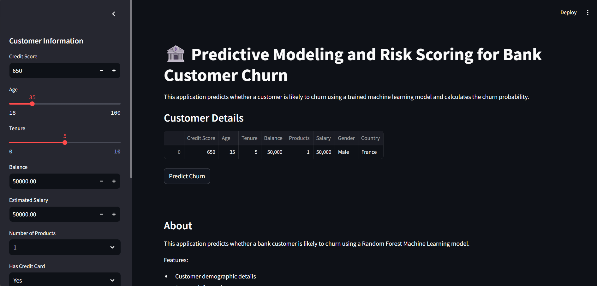
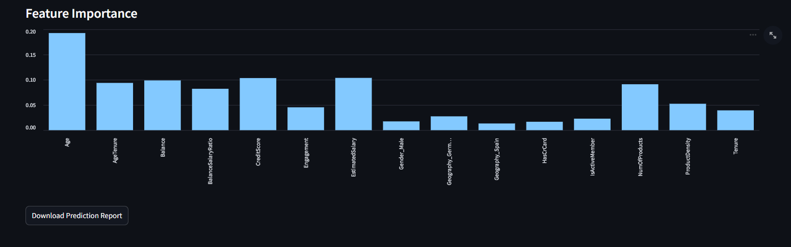

# 🏦 Predictive Modeling and Risk Scoring for Bank Customer Churn

## 🌐 Live Demo
👉 https://bank-customer-churn-prediction-xxxxxxxx.streamlit.app

## 📂 GitHub Repository
https://github.com/abhay1278/Bank-Customer-Churn-Prediction

## 📌 Project Overview

This project predicts whether a bank customer is likely to churn using Machine Learning. The application is built with Streamlit and allows users to input customer details, calculate churn probability, generate a customer risk score, and receive business recommendations.

The project demonstrates an end-to-end Machine Learning workflow including data preprocessing, feature engineering, model training, deployment, and interactive visualization.

---

## 🚀 Features

- Predict customer churn
- Calculate churn probability
- Customer Risk Score (0–100)
- Interactive Gauge Chart
- Feature Importance Visualization
- Business Recommendations
- Download Prediction Report (CSV)
- User-friendly Streamlit Dashboard

---

## 📂 Dataset

- Dataset: Bank Customer Churn Dataset
- Records: 10,000 Customers
- Target Variable: Exited

---

## 🛠️ Technologies Used

- Python
- Pandas
- NumPy
- Scikit-learn
- Streamlit
- Plotly
- Joblib

---

## ⚙️ Machine Learning Pipeline

### Data Preprocessing

- Removed unnecessary columns
- One-Hot Encoding
- Feature Scaling using StandardScaler

### Feature Engineering

- BalanceSalaryRatio
- ProductDensity
- Engagement
- AgeTenure

### Model

- Random Forest Classifier

---

## 📊 Application Workflow

1. Enter customer information.
2. Click **Predict Churn**.
3. View prediction result.
4. Check churn probability.
5. Analyze customer risk score.
6. Review business recommendations.
7. Download prediction report.

---

## 📸 Screenshots

### Dashboard



### Prediction Result


### Feature Importance



## 📁 Project Structure

```
Bank-Customer-Churn-Prediction/
│
├── app.py
├── churn_model.pkl
├── scaler.pkl
├── requirements.txt
├── README.md
├── bank_churn.csv
└── screenshots/
```

---

## ▶️ Installation

Clone the repository

```bash
git clone https://github.com/yourusername/Bank-Customer-Churn-Prediction.git
```

Install dependencies

```bash
pip install -r requirements.txt
```

Run the application

```bash
streamlit run app.py
```

---

## 📈 Future Improvements

- SHAP Explainability
- PDF Report Generation
- Database Integration
- User Authentication
- Cloud Deployment

---

## 👨‍💻 Author

**Abhay Singh**

MBA Business Analytics

GitHub: *(Add your GitHub profile link here)*

LinkedIn: *(Add your LinkedIn profile link here)*

---

## 📄 License

This project is created for educational and portfolio purposes.
